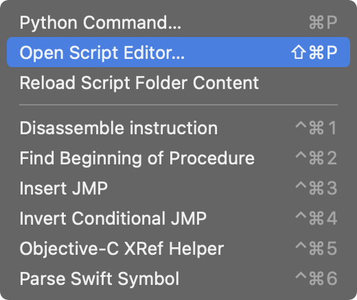
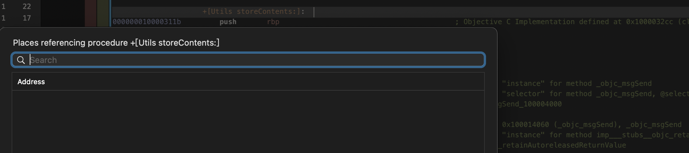
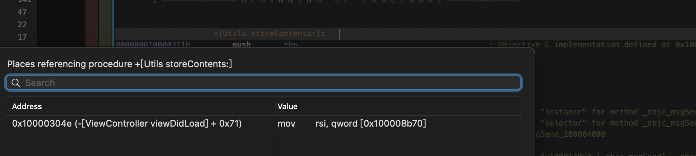

<p align="center">

</p>
**HopperScripts V5**
===

The script stash for Hopper Disassembler v5. Focus on Apple platforms and personal use cases.

Install
---

1. Clone the repo for scripts
2. `cd ~/Library/Application\ Support/Hopper/Scripts/` (or open Hopper and type `Command + Shift + P` and open scripts folder)
3. Copy the scripts into scripts folder
4. Reload scripts and run from 



Objective-C XRef Helper.py
---

> When deployment target on iOS 14+/tvOS 14+/watchOS 7+/macOS 11+, Objective-C runtime will use the relative method list to optimize memory usage. Learn [WWDC 2020 - Advancements in the Objective-C runtime](https://developer.apple.com/videos/play/wwdc2020/10163/?time=479)
> 
> However Hopper (v5.5.3) seems could not parse the selector and calls. So this scripts fix this and add the XRef between calls.
> 
> You can teach ld64 to force enable relative method list via `-objc_relative_method_lists` as well.

+ Demo

```objectivec
- (void)viewDidLoad {
    [super viewDidLoad];
    self.username = [Utils currentUserName];
    [Utils storeContents:@"Teststring"];
}
```

+ Before Script



+ After Script



Related Links
---
* [Rewriting IDAPython Script objc2_xrefs_helper.py for Hopper](https://www.fortinet.com/blog/threat-research/rewriting-idapython-script-objc2-xrefs-helper-py-for-hopper)
* [ld64 objc_relative_method_lists](https://github.com/apple-oss-distributions/ld64/blob/ld64-609/src/ld/Options.cpp#L3663)
* [objc4 smallMethodList](https://github.com/apple-oss-distributions/objc4/blob/objc4-841.13/runtime/objc-runtime-new.h#L761-L929)